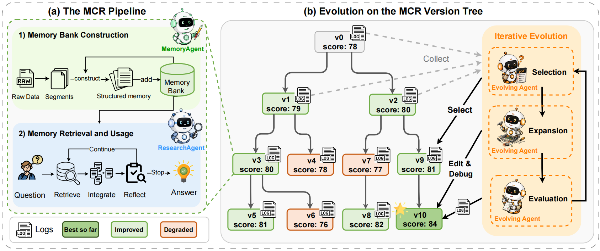

<div align="center">

<h1>MemPro: Agentic Memory Systems as Evolvable Programs</h1>

<h5 align="center">
<a href='https://arxiv.org/abs/2606.00619'></a>
<a href='https://github.com/hotpotqa/hotpot'></a>
<a href='https://github.com/google-deepmind/narrativeqa'></a>
<a href='https://github.com/snap-research/locomo'></a>
<a href='https://github.com/xiaowu0162/longmemeval'></a>

</h5>
</div>

## 📖 Introduction

MemPro addresses the limitations of fixed-pipeline agentic memory systems by treating the entire memory construction–retrieval (MCR) pipeline as an evolvable program rather than adapting only the memory bank or prompt text. It maintains a version tree of runnable pipeline implementations, where an Evolving Agent iteratively selects promising versions, diagnoses recurring failure modes, and creates improved child versions through failure-mode-guided edit–debug refinement. MemPro consistently outperforms strong static and prompt-level evolving baselines within a few iterations across LongMemEval, LoCoMo, HotpotQA, and NarrativeQA, and continues to improve as the version tree expands.



## ⚙️ Setup

### 1. Clone

```bash
git clone https://github.com/wanghai673/MemPro.git
cd MemPro
```

### 2. Create Conda Environment

```bash
conda create -n mempro python=3.10 -y
conda activate mempro
```

### 3. Install Dependencies

```bash
pip install -r requirements.txt
pip install -e .
```

> `pip install -e .` installs the initial `mempro_memory` package from `initial_framework/`. Evaluation scripts override it with the best evolved runtime for each benchmark.

### 4. Download Data

```bash
bash scripts/download_data.sh
```

### 5. Configure `.env`

```bash
cp .env.example .env
```

Edit `.env` with your OpenAI-compatible endpoint:

```bash
OPENAI_API_KEY=your_api_key_here
OPENAI_BASE_URL=https://api.openai.com/v1
OPENAI_MODEL=gpt-4o-mini
OPENAI_API_TYPE=openai
```

You can also set role-specific variables such as `MEMORY_MODEL`, `RESEARCH_MODEL`, `WORKING_MODEL`, and `JUDGE_MODEL`.

> Keep `.env` local because it contains credentials. The repository already excludes it from version control.

## 🔧 Reproduction Guide

### Part 1: Evaluation

Each evaluation script loads `.env`, uses the corresponding runtime under `best_versions/`, writes outputs to `results/`, and writes logs to `logs/`. The default worker count is `1`; increase it with environment variables only when your machine and API quota can support parallel requests.

#### LoCoMo

```bash
bash scripts/eval_locomo.sh
```

#### LongMemEval

```bash
bash scripts/eval_longmemeval.sh
```

#### HotpotQA

```bash
bash scripts/eval_hotpotqa.sh
HOTPOTQA_DATA=data/hotpotqa/eval_1600.json bash scripts/eval_hotpotqa.sh
HOTPOTQA_DATA=data/hotpotqa/eval_3200.json bash scripts/eval_hotpotqa.sh
```

#### NarrativeQA

```bash
bash scripts/eval_narrativeqa.sh
```

### Part 2: Evolution

The `MemPro/` directory contains benchmark-specific evolution workspaces. To continue evolution with Codex, choose a benchmark:

```bash
python scripts/run_evolution.py hotpotqa --execute
python scripts/run_evolution.py locomo --execute
python scripts/run_evolution.py longmemeval --execute
python scripts/run_evolution.py narrativeqa --execute
```

## 📁 Repository Structure

```
MemPro/
├── README.md
├── requirements.txt
├── setup.py
├── pyproject.toml
├── figs/                       # README figures
├── best_versions/              # Best evolved runnable MemPro frameworks
│   ├── locomo/
│   ├── longmemeval/
│   ├── hotpotqa/
│   └── narrativeqa/
├── eval/                       # Benchmark evaluation drivers
│   ├── locomo_test.py
│   ├── longmemeval_test.py
│   ├── hotpotqa_test.py
│   └── narrativeqa_test.py
├── MemPro/                     # Evolution workspaces
│   ├── locomo/AGENTS.md
│   ├── longmemeval/AGENTS.md
│   ├── hotpotqa/AGENTS.md
│   └── narrativeqa/AGENTS.md
├── initial_framework/          # Initial MemPro framework package
├── scripts/                    # Download, evaluation, and evolution helpers
├── download_data/              # Dataset download utilities
├── data/                       # Generated or downloaded by local setup; not tracked
├── results/                    # Evaluation outputs written by local runs; not tracked
└── logs/                       # Runtime logs written by local runs; not tracked
```

## 📄 Acknowledgement

Our work is built on the following datasets and codebases, and we are deeply grateful for their contributions.

- [HotpotQA](https://github.com/hotpotqa/hotpot): Multi-hop question answering benchmark.
- [NarrativeQA](https://github.com/google-deepmind/narrativeqa): Reading comprehension benchmark over narratives.
- [LoCoMo](https://github.com/snap-research/locomo): Long-context multi-session conversation benchmark.
- [LongMemEval](https://github.com/xiaowu0162/longmemeval): Long-term memory evaluation benchmark.
- [General Agentic Memory (GAM)](https://github.com/VectorSpaceLab/general-agentic-memory): Prior memory-framework research we build upon.
- [LightMem](https://github.com/zjunlp/LightMem): Memory framework ideas and code we build upon.

## 🥰 Citation

We appreciate your citations if you find our paper relevant and useful to your research!

```bibtex
@article{liu2026mempro,
  title={MemPro: Agentic Memory Systems as Evolvable Programs},
  author={Liu, Qingshan and Wang, Guoqing and Wu, Wen and Huang, Jingqi and Tao, Xinqi and Song, Dejia and Zhou, Jie and He, Liang},
  journal={arXiv preprint arXiv:2606.00619},
  year={2026}
}
```

## 📧 Contact

For questions, suggestions, or bug reports, please contact:

```
51285901015@stu.ecnu.edu.cn
```
