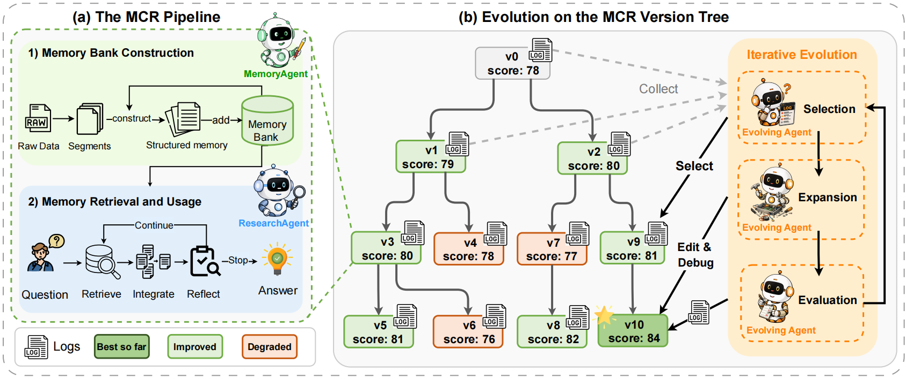

<div align="center">

<h1>✨ MemPro: Agentic Memory Systems as Evolvable Programs</h1>

<h5>If you like our project, please give us a star ⭐ on GitHub for the latest update.</h5>

<div align="center">

[](https://arxiv.org/abs/2606.00619)
[](https://huggingface.co/papers/2606.00619)
[](https://github.com/wanghai673/MemPro)

</div>
</div>

## 📣 Latest News

- **[Aug 21, 2026]**: 🎉 MemPro has been accepted to the **Main Conference of EMNLP 2026**!
- **[May 30, 2026]**: 📄 Our paper is now available on [arXiv](https://arxiv.org/abs/2606.00619) and [Hugging Face](https://huggingface.co/papers/2606.00619).

## 💡 Method Overview

We introduce MemPro, a framework for automatically evolving agentic memory systems. By treating the entire memory construction–retrieval (MCR) pipeline, including its prompts and code, as an evolvable program, MemPro iteratively selects promising versions, expands them through targeted editing and debugging, and evaluates new candidates within a version tree.

<p align="center">
  
</p>

## 🚀 Quick Start

### 1. Installation

```bash
git clone https://github.com/wanghai673/MemPro.git
cd MemPro

conda create -n mempro python=3.10 openjdk=21 -y
conda activate mempro

pip install -r requirements.txt
pip install -e .
```

### 2. Prepare Data and API

```bash
bash scripts/download_data.sh
cp .env.example .env
```

### 3. Evaluation

```bash
bash scripts/eval_locomo.sh
```

### 4. Evolution

```bash
python scripts/run_evolution.py locomo --execute
```

## 📁 Repository Structure

```
MemPro/
├── README.md
├── requirements.txt
├── setup.py
├── pyproject.toml
├── figs/                       # README figures
├── best_versions/              # Best evolved runnable MemPro frameworks
│   ├── locomo/
│   ├── longmemeval/
│   ├── hotpotqa/
│   └── narrativeqa/
├── eval/                       # Benchmark evaluation drivers
│   ├── locomo_test.py
│   ├── longmemeval_test.py
│   ├── hotpotqa_test.py
│   └── narrativeqa_test.py
├── MemPro/                     # Evolution workspaces
│   ├── locomo/AGENTS.md
│   ├── longmemeval/AGENTS.md
│   ├── hotpotqa/AGENTS.md
│   └── narrativeqa/AGENTS.md
├── initial_framework/          # Initial MemPro framework package
├── scripts/                    # Download, evaluation, and evolution helpers
├── download_data/              # Dataset download utilities
├── data/                       # Generated or downloaded by local setup; not tracked
├── results/                    # Evaluation outputs written by local runs; not tracked
└── logs/                       # Runtime logs written by local runs; not tracked
```

## 📄 Acknowledgement

Our initial framework is adapted from [General Agentic Memory (GAM)](https://github.com/VectorSpaceLab/general-agentic-memory), and we thank the authors for their valuable open-source contribution.

## 🥰 Citation

We appreciate your citations if you find our paper relevant and useful to your research!

```bibtex
@article{liu2026mempro,
  title={MemPro: Agentic Memory Systems as Evolvable Programs},
  author={Liu, Qingshan and Wang, Guoqing and Wu, Wen and Huang, Jingqi and Tao, Xinqi and Song, Dejia and Zhou, Jie and He, Liang},
  journal={arXiv preprint arXiv:2606.00619},
  year={2026}
}
```

## 📧 Contact

For questions, suggestions, or bug reports, please contact:

```
51285901015@stu.ecnu.edu.cn
```
